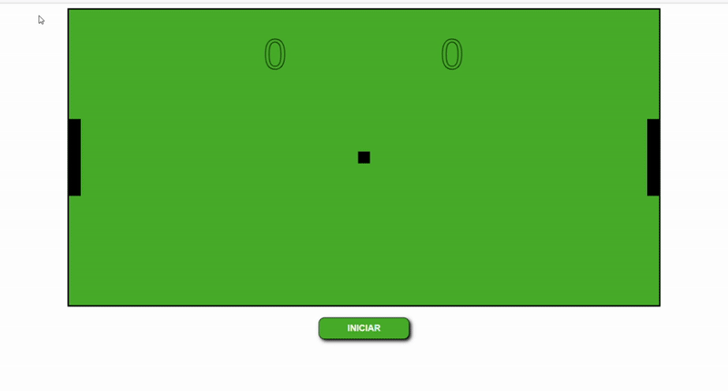

# 🎮 Game Web com JavaScript e Canvas

Projeto de um **jogo web interativo** desenvolvido com **JavaScript puro (Vanilla JS)** e a API **Canvas**, focado em lógica de programação, animações e manipulação de gráficos 2D diretamente no navegador.

---

## 🎥 Apresentação

<p align="center">
  
</p>


---

## 🕹️ Funcionalidades

- 🎯 Jogabilidade interativa com controle via teclado
- 🎨 Gráficos desenhados com a API `Canvas`
- 🔁 Loop de animação com movimentação contínua
- 💥 Colisões e marcação de pontuação
- 💻 Totalmente executado no navegador, sem dependências externas

---

## 🔗 Acesse o Jogo

👉 [**Jogar agora**](https://seu-link-aqui.com)


---

## 📂 Tecnologias Utilizadas

- HTML5
- CSS3
- JavaScript (Vanilla JS)
- Canvas API

---

## 🚀 Como Jogar

1. Acesse o link do jogo.
2. Use o teclado (setas ou teclas específicas) para interagir.
3. Divirta-se com a mecânica do jogo!

---

## 📁 Estrutura do Projeto

```
📦 pong-game-canvas/
├── index.html
├── style.css
├── script.js
└── README.md
```

---

## 📌 Observações

- Ideal para fins educacionais e portfólios de desenvolvedores iniciantes/intermediários.
- Demonstra o uso direto da API Canvas sem bibliotecas externas.

---

## 📄 Licença

Este projeto está licenciado sob a [MIT License](LICENSE).
